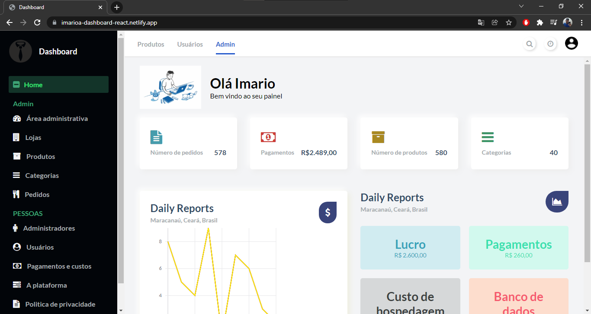

# Dashboard UI
 
 
 

  

  

 

## 💻 Projeto

Projeto desenvolvido para eu aprimorar minhas habilidades em React Js e Css. Tive como base o seguinte vídeo -> [video](https://www.youtube.com/watch?v=g6YExOi0-Fc&ab_channel=JulioFilho%5BDeveloper%5D)
 

 

## 🌐 Preview
<h1 align="center">
    
</h1>

## 🚀 Tecnologias

Esse projeto foi desenvolvido com as seguintes tecnologias:

- [React](https://reactjs.org)
- Css

 

## 🔨 Deploy Netlify

 

  By <a href="https://www.linkedin.com/in/imarioa/"> Imario Almeida </a>

